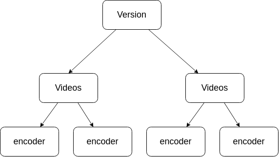

# VVC Frame Log

## `VVC_output`
### `VVC_output(file_path:str, qps, frames:int=-1)`

`VVC_output` is a data structure inherited from `pandas.DataFrame` that parse the content of a VVC_output log. The structure contains the following `columns` and `indexes`:

| | | frame | bitrate | Y_PSNR | U_PSNR | V_PSNR | YUV_PSNR | QP |
| --- | --- | --- | --- | --- | --- | --- | --- | --- |
| $i_0$ | | $f_0$ | $b_0$ | $Y_0$ | $U_0$ | $V_0$ | $YUV_0$ | $QP$ |
| $i_1$ | | $f_1$ | $b_1$ | $Y_1$ | $U_1$ | $V_1$ | $YUV_1$ | $QP$ |
| $\vdots$ | | $\vdots$ | $\vdots$ | $\vdots$ | $\vdots$ | $\vdots$ | $\vdots$ | $\vdots$ |
| $i_n$ | | $f_n$ | $b_n$ | $Y_n$ | $U_n$ | $V_n$ | $YUV_n$ | $QP$ |


## `VVC_output` parameters:

### `file_path`: 
    
**Path to** $n$ **VVC log files** with different quantization parameters, but from the same video encoded by the same way.


_example:_

    file_path = [
        BQMall_AI_22.vvclog, 
        BQMall_AI_27.vvclog, 
        BQMall_AI_32.vvclog, 
        BQMall_AI_37.vvclog
    ]
all these files are the same video, using same configuration set but each one has a different QP

### `qps`: 

**QPs of the files in file_path**

_example: (same as previous)_ 

    qps = [22, 27, 32, 37]

### `frames`: 

**Number of frames that must be given by the log**

observation: leave it as `-1` to get only the general video values, otherwise, it will contains all the frames and the general values.

## `BD_Rate`
### `BD_Rate(cmp_df : VVC_output = None, ref_df : VVC_output = None, satd = None, video = None, cfg = None, qps=4)`

`BD_Rate` is a data structure that inherits from `pandas.Series` and countains the comparing `BD Rate` between two different `VVC_output` structures. It is implemented by a pandas multi index series, where the `indexes` are like above:


| version | video | encoder | frame | bd_rate |
| --- | --- | --- | --- | --- |
| $vs$ | $vid$ | $enc$ | $f$ | $bdr$ |

it means that the indexes are: `(version, video, encoder, frame)` and the data is the `bd_rate`.

## `BD_Rate` parameters:

### `cmp_df`:
The VVC_output that we want to analyse.

### `ref_df`:
The VVC_output that we has as reference to compare.

### `version`: 
Version of software.

### `video`:
Video analysed.

### `cfg`:
Encoder used.

### `qps`
Number of qps analysed (usually 4).


## `VVC_frame_analysis`

Function that analyses the BD Rate of $n$ files, based on a file tree such as:



It will return a data structure like:

| approximation | video | encoder | frame | bd_rate |
| --- | --- | --- | --- | --- |
| $a_0$ | $v_0$ | $e_0$ | $f_0$ | $bdr_0$ |
|  |  |  | $f_1$ | $bdr_1$ |
| | | | $\vdots$ | $\vdots$ |
|  |  |  | $f_n$ | $bdr_n$ |
|  |  | $e_1$ | $f_0$ | $bdr_0$ |
|  |  |  | $f_1$ | $bdr_1$ |
| | | | $\vdots$ | $\vdots$ |
|  |  |  | $f_n$ | $bdr_n$ |
| | | $\vdots$ | $\vdots$ | $\vdots$ |
|  |  | $e_m$ | $f_0$ | $bdr_0$ |
|  |  |  | $f_1$ | $bdr_1$ |
| | | | $\vdots$ | $\vdots$ |
|  |  |  | $f_n$ | $bdr_n$ |
|  | $v_1$ | $e_0$ | $f_n$ | $bdr_n$ |
|  |  |  | $f_1$ | $bdr_1$ |
| | | | $\vdots$ | $\vdots$ |
|  |  |  | $f_n$ | $bdr_n$ |
| $\vdots$ | $\vdots$ | $\vdots$ | $\vdots$ | $\vdots$ |
| $f_n$ | $b_n$ | $Y_n$ | $U_n$ | $V_n$ |


## `VVC_Log()` parameters:

### `approximations` 

_example:_

    approximations = [
        '4x4-1-8x8-1', 
        '4x4-1-8x8-2', 
        '...', 
        '8x8-SAD'
    ]

### `file_names`

_example:_

    file_names = [
        'BQMall', 
        'BasketballPass', 
        'BasketballDrive', 
        '...', 
        'RaceHorses'
    ]

### `path`

path to the approximations

### `all_frames`

Decides if it will return the BD_Rate for all the frames of the video or just the general BD_Rate.

# VVC_execute_simulation

**def vvc_execute_simulation( cfg_vid_dir:str, output_dir:str, vtm_path:str, qps : list = [22, 27, 32, 37], enc_cfgs : list = ['AI','LB','RA'], version : str = 'Precise', num_frames : int = 32, enable_gprof : bool = True, enable_background_execution : bool = False, src_modify_file: str = None, dst_modify_file: str = None)**

Runs a simulation of the VVC Software VTM using different parameters. This function will run the software to all the videos in `cfg_vid_dir`, with all the quantization parameters in `qps`, using all of the configurations in `enc_cfgs`. Then it will store all the logs in the folder `output_dir`.

It is possible to modify `VTM` using `src_modify_file` and `dst_modify_file`.

**Parameters:**

**cfg_vid_dir** : *str*,\
path to the directory where the vvc configuration files are stored.

**output_dir** : *str*,\
path to the output directory. If it exists, then the software will create a new folder with the same name to avoid overwriting problems.

**vtm_path** : *str*,\
path to the VTM folder `VVCSoftware_VTM`.

**qps** : *list* *default* [22, 27, 32, 37],\
List of quantization parameters used to the simulation.

**enc_cfgs** : *list* *default* ['AI','LB','RA'],\
List of encoder configurations that will be used to the simulation.

**version** : *str* *default* 'Precise',\
Optional, it will distinguish the different versions at the simulation. For example, if it is needed to run the software with some changes, it it possible to distinguish the 'Precise' version to the 'Changed' version.

**num_frames** : *int* *default* 32,\
Numbers of frames encoded by video.

**enable_gprof** : *bool* *default* True,\
Turns on the profiling log using GNU profiler.

**enable_background_execution** : *bool* *default* False,\
If it is true, then the software will run in background.

**src_modify_file** : *str* *default* None,\
If it is needed to change some file of the VTM, then this value must be set to the path to the new file that must be included.

**dst_modify_file** : *str* *default* None,\
The file that will be overwrited by the `src_modify_file`.

## Implementation example:
     
```python
from source.vvc_execute_simulation import vvc_execute_simulation

output_dir = 'output'
cfg_vid_dir = 'video-cfg'
vtm_path = '\home\user\VVCSoftware_VTM'

vvc_execute_simulation(
    cfg_vid_dir = cfg_vid_dir, 
    output_dir  = output_dir, 
    vtm_path    = vtm_path, 
    num_frames  = 32, 
)
```

## file structure representation:
> output
> > gprof_log
> > > AI
> > > > log_video1_qp22_AI_Precise.gplog\
> > > > log_video1_qp27_AI_Precise.gplog\
> > > > log_video2_qp22_AI_Precise.gplog\
> > > > log_video2_qp27_AI_Precise.gplog

> > > LB\
> > > RA

> > videos_bin
> > > videos.bin

> > vvc_log
> > > AI
> > > LB
> > > RA